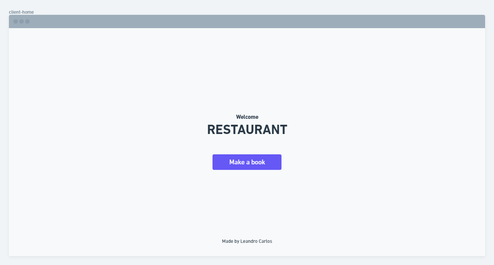
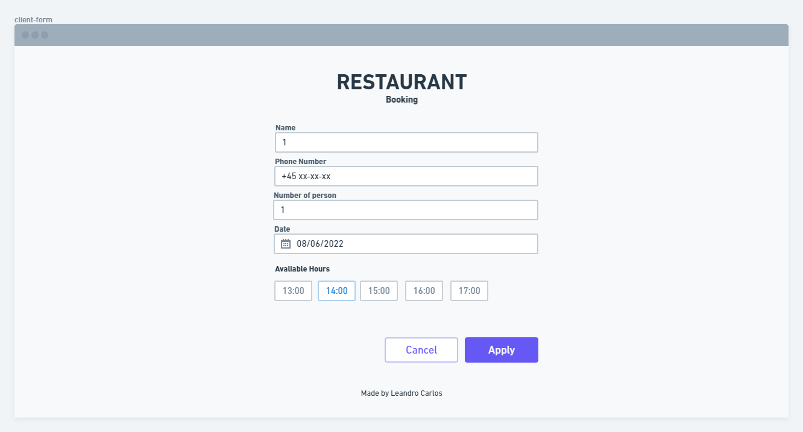
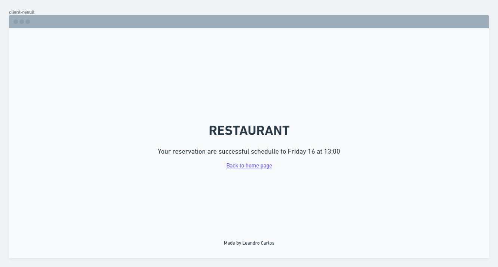

# SUPERB - Booking manager

Looking for the backend server repository? [Click Here](https://github.com/leandrocoder/superb-exercise-server)

## Restaurant booking website

The objective of this page is to able clients to find a table passing the number of chairs (people) and the wanted date. After that, the user applies your choice sending the request to a queue which will be processed by the backend server.

- [Planing](#planing)
- [Framework](#framework)
- [Run and Build](#run-and-build)

## Planing

First of all, I draw the site sessions in the [Whimsical](https://whimsical.com), keeping in mind the simplicity and also trying to give a good user experience to the final clients.



*Home, just with a button link to booking form*



*Booking form, that collect the name, phone, number of chairs and wanted date/hour of reservation*



*Booking form result that displays a message saying to the user that the request has been added to the queue*

## Framework

The selected front end framework to this project is [Vue.js](https://vuejs.org/), combining to graphic framework [Vuetify](https://vuetifyjs.com/), cause of my previous familiarity and being simple to work enabling the focus on functionality.

All the requests are made using the native fetch browser api.

## Install

As a Vue.js application, to run use these commands:

```
npm i
npm run dev
```

To build use:

```
npm i
npm run build
```

For more instructions about Docker deployment in the AWS, go to [server`s documentation](https://github.com/leandrocoder/superb-exercise-server).


